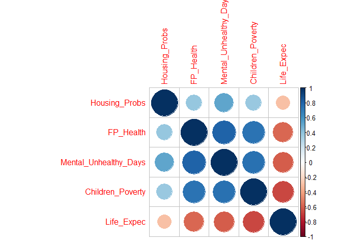
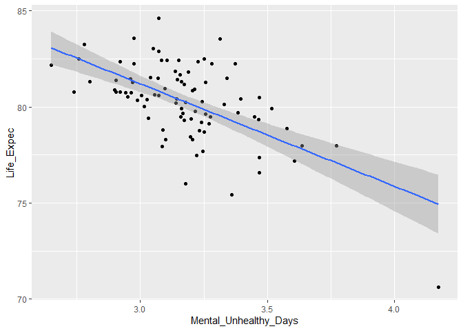

Effects of Housing Problems and Home Life on our Overall Health
================
Brett Vetter
2021-04-19

## Abstract

Often times when people think of public health, the home you live in
does not come to mind. But many people all over the country and in
Minnesota have severe housing problems. A home with severe housing
problems are households with at least one of four housing problems:
overcrowding, high housing costs, lack of kitchen facilities, or lack of
plumbing facilities. These things affect your everyday life and tend to
be ignored when it comes to your overall health. People tend to not
correlate living in poverty or our mental health at home with our
overall health either. So the question I have is, do severe housing
problems, living in poverty growing up and living with untreated poor
mental health have an effect on your overall health and your life
expectancy? I will be using data from the Minnesota Health Outcomes data
set, from countyhealthrankings.org. The data set consists of variables
pertaining to health outcomes from the year 2020, specifically looking
at the counties in Minnesota.

## Introduction

My exploratory data analysis will look at the correlation between % of
severe housing problems, average number of mentally unhealthy days, % of
children in poverty and % of smokers with life expectancy and % of fair
or poor health among counties in Minnesota. I will be looking at the
correlation some unaddressed issues I mentioned have on our overall
health, along with the correlation other more addressed issues have on
our overall health. I believe the results of this analysis will help
medical and public health workers better focus on simple health factors
like where people eat, sleep and spend most of their time to help
diagnose and more efficiently treat people’s health issues. When
treating patients for health issues we need to pay more attention to the
factors that may be the root to their issues and correcting those
factors within our communities.

## Methods

### Data Acquisition

I found my data on countyhealthrankings.org (U of Wisconsin 2020). I
specifically looked at the Minnesota county health rankings. There I
found and chose the excel sheet “2020 Minnesota Data” and downloaded it.
After I downloaded the excel sheet, I saved the data set to my data
folder I created.

### Data Description

My data consists of 90 rows, each row representing a different county in
Minnesota. The variables I chose to use from the data set were: Deaths -
Numerical Discrete % Housing problems - Numerical Continuous % Fair or
poor health - Numerical Continuous Life expectancy - Numerical
Continuous % Smokers - Numerical Continuous Average number of mentally
unhealthy days - Numerical Continuous % of children in poverty -
Numerical Continuous

### Data Preparation

For this data analysis I used Rstudio version 1.3.1093 (RStudio Team
2020) which is in R version 4.0.3(R Core Team 2020). I had to download
my data through excel, so to get the data into my own data table in r
studio I used the packages dplyr (Wickham et. al 2020) and readxl
(Wickham and Bryan 2019). I then assigned the function read\_excel to
the term “download data”. This function allows me to read in data coming
from an excel file. Within that function I then used the sheet and skip
functions to select which sheets of data I was using for my analysis.
The data contained many variables I was not interested in, which I
removed. The ones I kept were: % of severe housing problems, average
number of mentally unhealthy days, % of children in poverty, % fair or
poor health, life expectancy, and % smokers.

## Results

    ## # A tibble: 88 x 240
    ##    FIPS  State  County Deaths `Years of Poten~ `95% CI - Low..~ `95% CI - High.~
    ##    <chr> <chr>  <chr>   <dbl>            <dbl>            <dbl>            <dbl>
    ##  1 27000 Minne~ <NA>    51060            5279.            5209.            5348.
    ##  2 27001 Minne~ Aitkin    278           10288.            7884.           12692.
    ##  3 27003 Minne~ Anoka    3129            5129.            4856.            5402.
    ##  4 27005 Minne~ Becker    411            6589.            5558.            7619.
    ##  5 27007 Minne~ Beltr~    537            8714.            7673.            9755.
    ##  6 27009 Minne~ Benton    378            5952.            5121.            6784.
    ##  7 27011 Minne~ Big S~     NA              NA               NA               NA 
    ##  8 27013 Minne~ Blue ~    555            5371.            4714.            6028.
    ##  9 27015 Minne~ Brown     240            5543.            4393.            6694.
    ## 10 27017 Minne~ Carlt~    429            6375.            5413.            7338.
    ## # ... with 78 more rows, and 233 more variables: Z-Score...8 <dbl>,
    ## #   YPLL Rate (AIAN) <dbl>, YPLL Rate (AIAN) 95% CI - Low <dbl>,
    ## #   YPLL Rate (AIAN) 95% CI - High <dbl>, YPLL Rate (Asian) <dbl>,
    ## #   YPLL Rate (Asian) 95% CI - Low <dbl>,
    ## #   YPLL Rate (Asian) 95% CI - High <dbl>, YPLL Rate (Black) <dbl>,
    ## #   YPLL Rate (Black) 95% CI - Low <dbl>,
    ## #   YPLL Rate (Black) 95% CI - High <dbl>, YPLL Rate (Hispanic) <dbl>,
    ## #   YPLL Rate (Hispanic) 95% CI - Low <dbl>,
    ## #   YPLL Rate (Hispanic) 95% CI - High <dbl>, YPLL Rate (White) <dbl>,
    ## #   YPLL Rate (White) 95% CI - Low <dbl>,
    ## #   YPLL Rate (White) 95% CI - High <dbl>, % Fair or Poor Health <dbl>,
    ## #   95% CI - Low...25 <dbl>, 95% CI - High...26 <dbl>, Z-Score...27 <dbl>,
    ## #   Average Number of Physically Unhealthy Days <dbl>, 95% CI - Low...29 <dbl>,
    ## #   95% CI - High...30 <dbl>, Z-Score...31 <dbl>,
    ## #   Average Number of Mentally Unhealthy Days <dbl>, 95% CI - Low...33 <dbl>,
    ## #   95% CI - High...34 <dbl>, Z-Score...35 <dbl>, Unreliable <chr>,
    ## #   % Low Birthweight <dbl>, 95% CI - Low...38 <dbl>, 95% CI - High...39 <dbl>,
    ## #   Z-Score...40 <dbl>, % LBW (AIAN) <dbl>, % LBW (AIAN) 95% CI - Low <dbl>,
    ## #   % LBW (AIAN) 95% CI - High <dbl>, % LBW (Asian) <dbl>,
    ## #   % LBW (Asian) 95% CI - Low <dbl>, % LBW (Asian) 95% CI - High <dbl>,
    ## #   % LBW (Black) <dbl>, % LBW (Black) 95% CI - Low <dbl>,
    ## #   % LBW (Black) 95% CI - High <dbl>, % LBW (Hispanic) <dbl>,
    ## #   % LBW (Hispanic) 95% CI - Low <dbl>, % LBW (Hispanic) 95% CI - High <dbl>,
    ## #   % LBW (White) <dbl>, % LBW (White) 95% CI - Low <dbl>,
    ## #   % LBW (White) 95% CI - High <dbl>, % Smokers <dbl>,
    ## #   95% CI - Low...57 <dbl>, 95% CI - High...58 <dbl>, Z-Score...59 <dbl>,
    ## #   % Adults with Obesity <dbl>, 95% CI - Low...61 <dbl>,
    ## #   95% CI - High...62 <dbl>, Z-Score...63 <dbl>, Food Environment Index <dbl>,
    ## #   Z-Score...65 <dbl>, % Physically Inactive <dbl>, 95% CI - Low...67 <dbl>,
    ## #   95% CI - High...68 <dbl>, Z-Score...69 <dbl>,
    ## #   % With Access to Exercise Opportunities <dbl>, Z-Score...71 <dbl>,
    ## #   % Excessive Drinking <dbl>, 95% CI - Low...73 <dbl>,
    ## #   95% CI - High...74 <dbl>, Z-Score...75 <dbl>,
    ## #   # Alcohol-Impaired Driving Deaths <dbl>, # Driving Deaths <dbl>,
    ## #   % Driving Deaths with Alcohol Involvement <dbl>, 95% CI - Low...79 <dbl>,
    ## #   95% CI - High...80 <dbl>, Z-Score...81 <dbl>, # Chlamydia Cases <dbl>,
    ## #   Chlamydia Rate <dbl>, Z-Score...84 <dbl>, Teen Birth Rate <dbl>,
    ## #   95% CI - Low...86 <dbl>, 95% CI - High...87 <dbl>, Z-Score...88 <dbl>,
    ## #   Teen Birth Rate (AIAN) <dbl>, Teen Birth Rate (AIAN) 95% CI - Low <dbl>,
    ## #   Teen Birth Rate (AIAN) 95% CI - High <dbl>, Teen Birth Rate (Asian) <dbl>,
    ## #   Teen Birth Rate (Asian) 95% CI - Low <dbl>,
    ## #   Teen Birth Rate (Asian) 95% CI - High <dbl>, Teen Birth Rate (Black) <dbl>,
    ## #   Teen Birth Rate (Black) 95% CI - Low <dbl>,
    ## #   Teen Birth Rate (Black) 95% CI - High <dbl>,
    ## #   Teen Birth Rate (Hispanic) <dbl>,
    ## #   Teen Birth Rate (Hispanic) 95% CI - Low <dbl>,
    ## #   Teen Birth Rate (Hispanic) 95% CI - High <dbl>,
    ## #   Teen Birth Rate (White) <dbl>, Teen Birth Rate (White) 95% CI - Low <dbl>,
    ## #   Teen Birth Rate (White) 95% CI - High <dbl>, # Uninsured <dbl>,
    ## #   % Uninsured <dbl>, 95% CI - Low...106 <dbl>, 95% CI - High...107 <dbl>, ...

    ## Rows: 88
    ## Columns: 240
    ## $ FIPS                                          <chr> "27000", "27001", "27003~
    ## $ State                                         <chr> "Minnesota", "Minnesota"~
    ## $ County                                        <chr> NA, "Aitkin", "Anoka", "~
    ## $ Deaths                                        <dbl> 51060, 278, 3129, 411, 5~
    ## $ `Years of Potential Life Lost Rate`           <dbl> 5278.514, 10287.669, 512~
    ## $ `95% CI - Low...6`                            <dbl> 5209.477, 7883.538, 4856~
    ## $ `95% CI - High...7`                           <dbl> 5347.551, 12691.801, 540~
    ## $ `Z-Score...8`                                 <dbl> NA, 2.02269573, -0.49789~
    ## $ `YPLL Rate (AIAN)`                            <dbl> NA, NA, 11523.69, 18536.~
    ## $ `YPLL Rate (AIAN) 95% CI - Low`               <dbl> NA, NA, 7594.183, 13117.~
    ## $ `YPLL Rate (AIAN) 95% CI - High`              <dbl> NA, NA, 16766.36, 25443.~
    ## $ `YPLL Rate (Asian)`                           <dbl> NA, NA, 3524.689, NA, NA~
    ## $ `YPLL Rate (Asian) 95% CI - Low`              <dbl> NA, NA, 2529.378, NA, NA~
    ## $ `YPLL Rate (Asian) 95% CI - High`             <dbl> NA, NA, 4781.638, NA, NA~
    ## $ `YPLL Rate (Black)`                           <dbl> NA, NA, 7014.995, NA, NA~
    ## $ `YPLL Rate (Black) 95% CI - Low`              <dbl> NA, NA, 5804.601, NA, NA~
    ## $ `YPLL Rate (Black) 95% CI - High`             <dbl> NA, NA, 8225.388, NA, NA~
    ## $ `YPLL Rate (Hispanic)`                        <dbl> NA, NA, 4669.178, NA, NA~
    ## $ `YPLL Rate (Hispanic) 95% CI - Low`           <dbl> NA, NA, 3527.047, NA, NA~
    ## $ `YPLL Rate (Hispanic) 95% CI - High`          <dbl> NA, NA, 6063.316, NA, NA~
    ## $ `YPLL Rate (White)`                           <dbl> NA, NA, 4970.727, 5463.5~
    ## $ `YPLL Rate (White) 95% CI - Low`              <dbl> NA, NA, 4676.420, 4481.3~
    ## $ `YPLL Rate (White) 95% CI - High`             <dbl> NA, NA, 5265.034, 6445.7~
    ## $ `% Fair or Poor Health`                       <dbl> 12.132421, 14.234822, 11~
    ## $ `95% CI - Low...25`                           <dbl> 11.481236, 13.689480, 11~
    ## $ `95% CI - High...26`                          <dbl> 12.81519, 14.82277, 12.2~
    ## $ `Z-Score...27`                                <dbl> NA, 1.03920257, -0.39307~
    ## $ `Average Number of Physically Unhealthy Days` <dbl> 2.926118, 3.499348, 3.14~
    ## $ `95% CI - Low...29`                           <dbl> 2.784826, 3.334130, 3.04~
    ## $ `95% CI - High...30`                          <dbl> 3.067411, 3.671133, 3.25~
    ## $ `Z-Score...31`                                <dbl> NA, 1.63110078, 0.389628~
    ## $ `Average Number of Mentally Unhealthy Days`   <dbl> 3.096623, 3.468418, 3.14~
    ## $ `95% CI - Low...33`                           <dbl> 2.946364, 3.291232, 3.03~
    ## $ `95% CI - High...34`                          <dbl> 3.246882, 3.654123, 3.26~
    ## $ `Z-Score...35`                                <dbl> NA, 1.272622095, -0.1146~
    ## $ Unreliable                                    <chr> NA, NA, NA, NA, NA, NA, ~
    ## $ `% Low Birthweight`                           <dbl> 6.594981, 6.265356, 6.26~
    ## $ `95% CI - Low...38`                           <dbl> 6.524981, 4.600538, 5.99~
    ## $ `95% CI - High...39`                          <dbl> 6.664982, 7.930174, 6.54~
    ## $ `Z-Score...40`                                <dbl> NA, 0.19242456, 0.196565~
    ## $ `% LBW (AIAN)`                                <dbl> NA, NA, 7.692308, 9.7505~
    ## $ `% LBW (AIAN) 95% CI - Low`                   <dbl> NA, NA, 4.0, 7.0, 5.9, N~
    ## $ `% LBW (AIAN) 95% CI - High`                  <dbl> NA, NA, 11.4, 12.5, 8.3,~
    ## $ `% LBW (Asian)`                               <dbl> NA, NA, 7.543612, NA, NA~
    ## $ `% LBW (Asian) 95% CI - Low`                  <dbl> NA, NA, 6.4, NA, NA, NA,~
    ## $ `% LBW (Asian) 95% CI - High`                 <dbl> NA, NA, 8.7, NA, NA, NA,~
    ## $ `% LBW (Black)`                               <dbl> NA, NA, 8.133814, NA, NA~
    ## $ `% LBW (Black) 95% CI - Low`                  <dbl> NA, NA, 7.2, NA, NA, 6.3~
    ## $ `% LBW (Black) 95% CI - High`                 <dbl> NA, NA, 9.1, NA, NA, 13.~
    ## $ `% LBW (Hispanic)`                            <dbl> NA, NA, 7.039598, NA, NA~
    ## $ `% LBW (Hispanic) 95% CI - Low`               <dbl> NA, NA, 5.8, NA, NA, NA,~
    ## $ `% LBW (Hispanic) 95% CI - High`              <dbl> NA, NA, 8.3, NA, NA, NA,~
    ## $ `% LBW (White)`                               <dbl> NA, NA, 5.828428, 5.4930~
    ## $ `% LBW (White) 95% CI - Low`                  <dbl> NA, NA, 5.5, 4.6, 4.6, 5~
    ## $ `% LBW (White) 95% CI - High`                 <dbl> NA, NA, 6.1, 6.4, 6.3, 6~
    ## $ `% Smokers`                                   <dbl> 14.51363, 15.17176, 14.5~
    ## $ `95% CI - Low...57`                           <dbl> 13.79303, 14.52364, 14.0~
    ## $ `95% CI - High...58`                          <dbl> 15.26521, 15.77496, 14.9~
    ## $ `Z-Score...59`                                <dbl> NA, 0.09769886, -0.24081~
    ## $ `% Adults with Obesity`                       <dbl> 27.9, 29.5, 30.4, 30.0, ~
    ## $ `95% CI - Low...61`                           <dbl> NA, 25.0, 28.6, 26.6, 30~
    ## $ `95% CI - High...62`                          <dbl> NA, 34.4, 32.2, 33.6, 37~
    ## $ `Z-Score...63`                                <dbl> NA, -0.5690984, -0.32439~
    ## $ `Food Environment Index`                      <dbl> 8.8, 7.7, 8.7, 7.8, 7.7,~
    ## $ `Z-Score...65`                                <dbl> NA, 0.9994060, -0.553242~
    ## $ `% Physically Inactive`                       <dbl> 20.1, 29.0, 19.8, 27.0, ~
    ## $ `95% CI - Low...67`                           <dbl> NA, 24.2, 18.3, 23.7, 20~
    ## $ `95% CI - High...68`                          <dbl> NA, 33.9, 21.4, 30.4, 25~
    ## $ `Z-Score...69`                                <dbl> NA, 1.2139089, -1.219381~
    ## $ `% With Access to Exercise Opportunities`     <dbl> 86.91456, 50.34564, 95.2~
    ## $ `Z-Score...71`                                <dbl> NA, 1.207529116, -1.5806~
    ## $ `% Excessive Drinking`                        <dbl> 21.71280, 18.55845, 21.1~
    ## $ `95% CI - Low...73`                           <dbl> 20.88478, 17.85492, 20.5~
    ## $ `95% CI - High...74`                          <dbl> 22.56428, 19.28128, 21.6~
    ## $ `Z-Score...75`                                <dbl> NA, -1.19384828, 0.17198~
    ## $ `# Alcohol-Impaired Driving Deaths`           <dbl> 571, 5, 29, 13, 9, 8, 1,~
    ## $ `# Driving Deaths`                            <dbl> 1903, 24, 92, 26, 24, 22~
    ## $ `% Driving Deaths with Alcohol Involvement`   <dbl> 30.00525, 20.83333, 31.5~
    ## $ `95% CI - Low...79`                           <dbl> 28.877312, 10.557714, 26~
    ## $ `95% CI - High...80`                          <dbl> 31.13921, 32.67516, 36.9~
    ## $ `Z-Score...81`                                <dbl> NA, -0.54957731, -0.0167~
    ## $ `# Chlamydia Cases`                           <dbl> 23539, 23, 1238, 89, 200~
    ## $ `Chlamydia Rate`                              <dbl> 422.1, 145.3, 352.3, 261~
    ## $ `Z-Score...84`                                <dbl> NA, -0.87977775, 0.76801~
    ## $ `Teen Birth Rate`                             <dbl> 14.215897, 14.374514, 10~
    ## $ `95% CI - Low...86`                           <dbl> 14.0, 10.1, 10.1, 17.7, ~
    ## $ `95% CI - High...87`                          <dbl> 14.4, 19.8, 11.6, 24.4, ~
    ## $ `Z-Score...88`                                <dbl> NA, -0.3929655, -0.77746~
    ## $ `Teen Birth Rate (AIAN)`                      <dbl> NA, NA, 16.39344, 45.253~
    ## $ `Teen Birth Rate (AIAN) 95% CI - Low`         <dbl> NA, NA, 8.7, 32.5, 82.2,~
    ## $ `Teen Birth Rate (AIAN) 95% CI - High`        <dbl> NA, NA, 28.0, 61.4, 104.~
    ## $ `Teen Birth Rate (Asian)`                     <dbl> NA, NA, 11.94624, NA, NA~
    ## $ `Teen Birth Rate (Asian) 95% CI - Low`        <dbl> NA, NA, 8.8, NA, NA, NA,~
    ## $ `Teen Birth Rate (Asian) 95% CI - High`       <dbl> NA, NA, 15.8, NA, NA, NA~
    ## $ `Teen Birth Rate (Black)`                     <dbl> NA, NA, 23.11883, NA, NA~
    ## $ `Teen Birth Rate (Black) 95% CI - Low`        <dbl> NA, NA, 19.5, NA, NA, 17~
    ## $ `Teen Birth Rate (Black) 95% CI - High`       <dbl> NA, NA, 26.7, NA, NA, 57~
    ## $ `Teen Birth Rate (Hispanic)`                  <dbl> NA, NA, 23.93674, NA, 36~
    ## $ `Teen Birth Rate (Hispanic) 95% CI - Low`     <dbl> NA, NA, 19.5, NA, 18.7, ~
    ## $ `Teen Birth Rate (Hispanic) 95% CI - High`    <dbl> NA, NA, 28.4, NA, 63.1, ~
    ## $ `Teen Birth Rate (White)`                     <dbl> NA, NA, 8.242731, 16.368~
    ## $ `Teen Birth Rate (White) 95% CI - Low`        <dbl> NA, NA, 7.5, 13.3, 9.5, ~
    ## $ `Teen Birth Rate (White) 95% CI - High`       <dbl> NA, NA, 9.0, 19.9, 14.3,~
    ## $ `# Uninsured`                                 <dbl> 235543, 694, 13881, 1843~
    ## $ `% Uninsured`                                 <dbl> 5.085244, 6.622769, 4.59~
    ## $ `95% CI - Low...106`                          <dbl> 4.846946, 5.669578, 4.11~
    ## $ `95% CI - High...107`                         <dbl> 5.323542, 7.575961, 5.07~
    ## $ `Z-Score...108`                               <dbl> NA, 0.54150312, -0.87504~
    ## $ `# Primary Care Physicians`                   <dbl> 4988, 13, 180, 28, 37, 8~
    ## $ `Primary Care Physicians Rate`                <dbl> 89.44509, 82.12774, 51.2~
    ## $ `Primary Care Physicians Ratio`               <chr> "1118:1", "1218:1", "195~
    ## $ `Z-Score...112`                               <dbl> NA, -0.34735605, 0.47720~
    ## $ `# Dentists`                                  <dbl> 4025, 5, 223, 20, 34, 15~
    ## $ `Dentist Rate`                                <dbl> 71.73181, 31.44259, 63.0~
    ## $ `Dentist Ratio`                               <chr> "1394:1", "3180:1", "158~
    ## $ `Z-Score...116`                               <dbl> NA, 1.06802380, -0.55641~
    ## $ `# Mental Health Providers`                   <dbl> 14112, 7, 571, 70, 167, ~
    ## $ `Mental Health Provider Rate`                 <dbl> 251.49795, 44.01962, 161~
    ## $ `Mental Health Provider Ratio`                <chr> "398:1", "2272:1", "620:~
    ## $ `Z-Score...120`                               <dbl> NA, 0.95231435, -0.19086~
    ## $ `Preventable Hospitalization Rate`            <dbl> 6015, 8597, 7191, 6913, ~
    ## $ `Z-Score...122`                               <dbl> NA, 1.38079045, 0.567941~
    ## $ `Preventable Hosp. Rate (AIAN)`               <dbl> NA, NA, 1391, 6477, 4462~
    ## $ `Preventable Hosp. Rate (Asian)`              <dbl> NA, NA, 3896, NA, NA, NA~
    ## $ `Preventable Hosp. Rate (Black)`              <dbl> NA, NA, 5578, NA, NA, NA~
    ## $ `Preventable Hosp. Rate (Hispanic)`           <dbl> NA, NA, 2095, NA, NA, NA~
    ## $ `Preventable Hosp. Rate (White)`              <dbl> NA, NA, 7234, 6908, 5813~
    ## $ `% With Annual Mammogram`                     <dbl> 46, 50, 42, 49, 45, 47, ~
    ## $ `Z-Score...129`                               <dbl> NA, -0.43038765, 0.83353~
    ## $ `% Screened (AIAN)`                           <dbl> NA, NA, 32, 19, 31, NA, ~
    ## $ `% Screened (Asian)`                          <dbl> NA, NA, 24, NA, NA, NA, ~
    ## $ `% Screened (Black)`                          <dbl> NA, NA, 28, NA, NA, NA, ~
    ## $ `% Screened (Hispanic)`                       <dbl> NA, NA, 39, NA, NA, NA, ~
    ## $ `% Screened (White)`                          <dbl> NA, NA, 43, 55, 49, NA, ~
    ## $ `% Vaccinated`                                <dbl> 50, 30, 48, 48, 45, 44, ~
    ## $ `Z-Score...136`                               <dbl> NA, 1.31701712, -0.32636~
    ## $ `% Vaccinated (AIAN)`                         <dbl> NA, NA, 36, 18, 30, NA, ~
    ## $ `% Vaccinated (Asian)`                        <dbl> NA, NA, 47, NA, NA, NA, ~
    ## $ `% Vaccinated (Black)`                        <dbl> NA, NA, 30, NA, 27, 31, ~
    ## $ `% Vaccinated (Hispanic)`                     <dbl> NA, NA, 41, NA, NA, NA, ~
    ## $ `% Vaccinated (White)`                        <dbl> NA, NA, 49, 52, 47, 44, ~
    ## $ `Cohort Size`                                 <dbl> 67148, 137, 4333, 353, 6~
    ## $ `High School Graduation Rate`                 <dbl> 83.20, 89.05, 82.69, 88.~
    ## $ `Z-Score...144`                               <dbl> NA, -0.36426775, 0.51531~
    ## $ `# Some College`                              <dbl> 1078178, 1512, 67036, 47~
    ## $ Population                                    <dbl> 1438512, 2493, 91765, 72~
    ## $ `% Some College`                              <dbl> 74.95092, 60.64982, 73.0~
    ## $ `95% CI - Low...148`                          <dbl> 74.48032, 54.95659, 71.2~
    ## $ `95% CI - High...149`                         <dbl> 75.42153, 66.34305, 74.8~
    ## $ `Z-Score...150`                               <dbl> NA, 1.0229672, -0.709464~
    ## $ `# Unemployed`                                <dbl> 89340, 402, 5432, 661, 9~
    ## $ `Labor Force`                                 <dbl> 3070229, 7162, 196586, 1~
    ## $ `% Unemployed`                                <dbl> 2.909881, 5.612957, 2.76~
    ## $ `Z-Score...154`                               <dbl> NA, 2.031226333, -0.7714~
    ## $ `% Children in Poverty`                       <dbl> 11.5, 20.1, 7.4, 15.8, 2~
    ## $ `95% CI - Low...156`                          <dbl> 10.785106, 13.904255, 5.~
    ## $ `95% CI - High...157`                         <dbl> 12.214894, 26.295745, 9.~
    ## $ `Z-Score...158`                               <dbl> NA, 1.544664320, -1.2917~
    ## $ `% Children in Poverty (AIAN)`                <dbl> NA, 32.456140, 9.109312,~
    ## $ `% Children in Poverty (Asian)`               <dbl> NA, NA, 7.239596, NA, 2.~
    ## $ `% Children in Poverty (Black)`               <dbl> NA, NA, 24.230361, 22.05~
    ## $ `% Children in Poverty (Hispanic)`            <dbl> NA, 3.409091, 13.124157,~
    ## $ `% Children in Poverty (White)`               <dbl> NA, 18.213970, 5.439211,~
    ## $ `80th Percentile Income`                      <dbl> 128766, 85305, 135014, 1~
    ## $ `20th Percentile Income`                      <dbl> 29819, 20938, 39466, 257~
    ## $ `Income Ratio`                                <dbl> 4.318253, 4.074171, 3.42~
    ## $ `Z-Score...167`                               <dbl> NA, 0.03429150, -1.56556~
    ## $ `# Single-Parent Households`                  <dbl> 355766, 1004, 22653, 221~
    ## $ `# Households`                                <dbl> 1276758, 2626, 83032, 82~
    ## $ `% Single-Parent Households`                  <dbl> 27.86480, 38.23305, 27.2~
    ## $ `95% CI - Low...171`                          <dbl> 27.36655, 31.21494, 25.5~
    ## $ `95% CI - High...172`                         <dbl> 28.36304, 45.25117, 28.9~
    ## $ `Z-Score...173`                               <dbl> NA, 1.50584692, -0.09937~
    ## $ `# Associations`                              <dbl> 7261, 26, 239, 60, 54, 4~
    ## $ `Social Association Rate`                     <dbl> 13.020464, 16.425548, 6.~
    ## $ `Z-Score...176`                               <dbl> NA, 0.25694313, 1.675584~
    ## $ `Annual Average Violent Crimes`               <dbl> 12949.5, 17.5, 437.5, 25~
    ## $ `Violent Crime Rate`                          <dbl> 235.93609, 112.06814, 12~
    ## $ `Z-Score...179`                               <dbl> NA, -0.13381644, 0.01515~
    ## $ `# Injury Deaths`                             <dbl> 17920, 97, 959, 138, 180~
    ## $ `Injury Death Rate`                           <dbl> 64.79957, 123.11676, 55.~
    ## $ `95% CI - Low...182`                          <dbl> 63.85080, 99.83940, 51.7~
    ## $ `95% CI - High...183`                         <dbl> 65.74834, 150.19200, 58.~
    ## $ `Z-Score...184`                               <dbl> NA, 2.47382320, -0.89019~
    ## $ `Injury Death Rate (AIAN)`                    <dbl> NA, NA, NA, 160.3458, 15~
    ## $ `Injury Death Rate (AIAN) 95% CI - Low`       <dbl> NA, NA, NA, 101.64548, 1~
    ## $ `Injury Death Rate (AIAN) 95% CI - High`      <dbl> NA, NA, NA, 240.5974, 19~
    ## $ `Injury Death Rate (Asian)`                   <dbl> NA, NA, 21.18594, NA, NA~
    ## $ `Injury Death Rate (Asian) 95% CI - Low`      <dbl> NA, NA, 12.55613, NA, NA~
    ## $ `Injury Death Rate (Asian) 95% CI - High`     <dbl> NA, NA, 33.48292, NA, NA~
    ## $ `Injury Death Rate (Black)`                   <dbl> NA, NA, 43.63916, NA, NA~
    ## $ `Injury Death Rate (Black) 95% CI - Low`      <dbl> NA, NA, 32.38982, NA, NA~
    ## $ `Injury Death Rate (Black) 95% CI - High`     <dbl> NA, NA, 57.53279, NA, NA~
    ## $ `Injury Death Rate (Hispanic)`                <dbl> NA, NA, 36.75119, NA, NA~
    ## $ `Injury Death Rate (Hispanic) 95% CI - Low`   <dbl> NA, NA, 24.42090, NA, NA~
    ## $ `Injury Death Rate (Hispanic) 95% CI - High`  <dbl> NA, NA, 53.11571, NA, NA~
    ## $ `Injury Death Rate (White)`                   <dbl> NA, NA, 58.97941, 74.653~
    ## $ `Injury Death Rate (White) 95% CI - Low`      <dbl> NA, NA, 55.02367, 60.765~
    ## $ `Injury Death Rate (White) 95% CI - High`     <dbl> NA, NA, 62.93515, 88.542~
    ## $ `Average Daily PM2.5`                         <dbl> 6.9, 6.1, 7.9, 6.8, 6.6,~
    ## $ `Z-Score...201`                               <dbl> NA, -1.20383100, 1.02453~
    ## $ `Presence of Water Violation`                 <chr> NA, "No", "Yes", "Yes", ~
    ## $ `Z-Score...203`                               <dbl> NA, -0.416721, 2.372104,~
    ## $ `% Severe Housing Problems`                   <dbl> 13.374873, 15.248691, 11~
    ## $ `95% CI - Low...205`                          <dbl> 13.196260, 13.537950, 11~
    ## $ `95% CI - High...206`                         <dbl> 13.55349, 16.95943, 12.4~
    ## $ `Severe Housing Cost Burden`                  <dbl> NA, 11.858594, 9.855480,~
    ## $ `Severe Housing Cost Burden 95% CI - Low`     <dbl> NA, 10.402132, 9.231004,~
    ## $ `Severe Housing Cost Burden 95% CI - High`    <dbl> NA, 13.315056, 10.479955~
    ## $ Overcrowding                                  <dbl> NA, 2.4214660, 1.9998403~
    ## $ `Overcrowding 95% CI - Low`                   <dbl> NA, 1.2501419, 1.6839499~
    ## $ `Overcrowding 95% CI - High`                  <dbl> NA, 3.592790, 2.315731, ~
    ## $ `Inadequate Facilities`                       <dbl> NA, 1.8324607, 0.4590452~
    ## $ `Inadequate Facilities 95% CI - Low`          <dbl> NA, 1.28215583, 0.297831~
    ## $ `Inadequate Facilities 95% CI - High`         <dbl> NA, 2.3827656, 0.6202584~
    ## $ `Z-Score...216`                               <dbl> NA, 1.387156834, -0.0110~
    ## $ `% Drive Alone to Work`                       <dbl> 77.90737, 80.20936, 82.5~
    ## $ `95% CI - Low...218`                          <dbl> 77.74825, 78.26193, 81.7~
    ## $ `95% CI - High...219`                         <dbl> 78.06648, 82.15679, 83.3~
    ## $ `Z-Score...220`                               <dbl> NA, 0.4087937, 1.0335146~
    ## $ `% Drive Alone (AIAN)`                        <dbl> NA, NA, 65.49521, 79.196~
    ## $ `% Drive Alone (AIAN) 95% CI - Low`           <dbl> NA, NA, 56.17778, 75.317~
    ## $ `% Drive Alone (AIAN) 95% CI - High`          <dbl> NA, NA, 74.81263, 83.074~
    ## $ `% Drive Alone (Asian)`                       <dbl> NA, NA, 79.16245, NA, NA~
    ## $ `% Drive Alone (Asian) 95% CI - Low`          <dbl> NA, NA, 74.45349, NA, NA~
    ## $ `% Drive Alone (Asian) 95% CI - High`         <dbl> NA, NA, 83.87140, NA, NA~
    ## $ `% Drive Alone (Black)`                       <dbl> NA, NA, 72.89994, NA, NA~
    ## $ `% Drive Alone (Black) 95% CI - Low`          <dbl> NA, NA, 66.53529, NA, NA~
    ## $ `% Drive Alone (Black) 95% CI - High`         <dbl> NA, NA, 79.26459, NA, NA~
    ## $ `% Drive Alone (Hispanic)`                    <dbl> NA, NA, 63.13263, NA, 52~
    ## $ `% Drive Alone (Hispanic) 95% CI - Low`       <dbl> NA, NA, 58.27619, NA, 38~
    ## $ `% Drive Alone (Hispanic) 95% CI - High`      <dbl> NA, NA, 67.98907, NA, 67~
    ## $ `% Drive Alone (White)`                       <dbl> NA, NA, 83.28017, 78.891~
    ## $ `% Drive Alone (White) 95% CI - Low`          <dbl> NA, NA, 82.47364, 76.545~
    ## $ `% Drive Alone (White) 95% CI - High`         <dbl> NA, NA, 84.08670, 81.238~
    ## $ `# Workers who Drive Alone`                   <dbl> 2879806, 6114, 186870, 1~
    ## $ `% Long Commute - Drives Alone`               <dbl> 30.9, 34.6, 43.5, 25.5, ~
    ## $ `95% CI - Low...238`                          <dbl> 30.66170, 31.73051, 42.4~
    ## $ `95% CI - High...239`                         <dbl> 31.13830, 37.46949, 44.5~
    ## $ `Z-Score...240`                               <dbl> NA, 0.70562454, 1.558121~

    ## # A tibble: 88 x 10
    ##    FIPS  State  County  Deaths Housing_Probs FP_Health Smokers Mental_Unhealthy~
    ##    <chr> <chr>  <chr>    <dbl>         <dbl>     <dbl>   <dbl>             <dbl>
    ##  1 27000 Minne~ <NA>     51060         13.4       12.1    14.5              3.10
    ##  2 27001 Minne~ Aitkin     278         15.2       14.2    15.2              3.47
    ##  3 27003 Minne~ Anoka     3129         11.8       11.9    14.5              3.14
    ##  4 27005 Minne~ Becker     411         13.4       12.6    16.6              3.20
    ##  5 27007 Minne~ Beltra~    537         14.6       15.2    19.4              3.64
    ##  6 27009 Minne~ Benton     378         14.5       12.7    16.8              3.27
    ##  7 27011 Minne~ Big St~     NA         11.5       12.8    14.6              3.14
    ##  8 27013 Minne~ Blue E~    555         15.3       13.7    16.0              3.39
    ##  9 27015 Minne~ Brown      240          9.77      11.3    12.6              2.92
    ## 10 27017 Minne~ Carlton    429         13.6       12.0    19.6              3.20
    ## # ... with 78 more rows, and 2 more variables: Children_Poverty <dbl>,
    ## #   Life_Expec <dbl>

<!-- --><!-- --><!-- --><!-- --><!-- --><!-- --><!-- --><!-- --><!-- --><!-- --><!-- -->

## Discussion

## Literature Cited

Hadley Wickham and Jennifer Bryan (2019). readxl: Read Excel Files. R
package version 1.3.1. <https://CRAN.R-project.org/package=readxl>

Hadley Wickham, Romain François, Lionel Henry and Kirill Müller (2020).
dplyr: A Grammar of Data Manipulation. R package version 1.0.2.
<https://CRAN.R-project.org/package=dplyr>

RStudio Team (2020). RStudio: Integrated Development Environment for R.
RStudio, PBC, Boston, MA URL <http://www.rstudio.com/>.

R Core Team (2020). R: A language and environment for statistical
computing. R Foundation for Statistical Computing, Vienna, Austria. URL
<https://www.R-project.org/>.

University of Wisconsin Population Health Institute. County Health
Rankings 2020. Available at www.countyhealthrankings.org. Accessed
3/4/2020.
